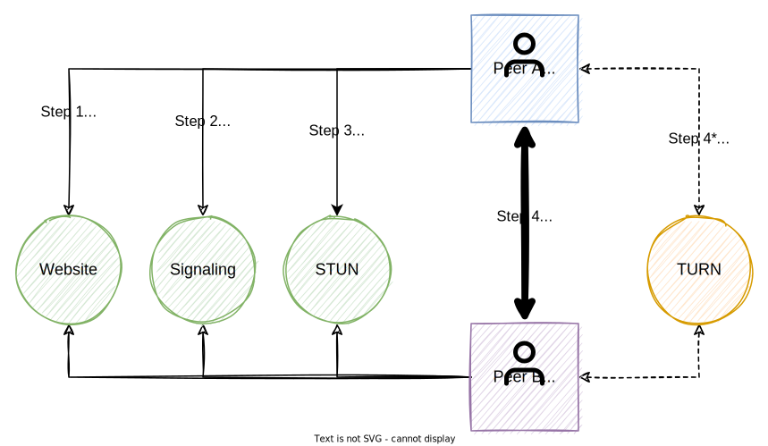

# Brie.fi/ng

> Wähle deine Sprache: [en](README.md) | [de](README-de.md)

 Der Datenschutz ist die zentrale Idee hinter diesem Projekt. Es werden ausschließlich offene Technologien (wie [WebRTC](https://webrtc-security.github.io/)) verwendet, die in allen modernen Browsern funktionieren. Somit ist keine Installation von zusätzlicher Software notwendig und der Ansatz bleibt zukunftssicher.

Über [Brie.fi/ng](https://brie.fi/ng) kann sofort gratis eine Unterhaltung begonnen werden. Eine [kostenlose iOS-App](https://apps.apple.com/app/briefing-video-chat/id1510803601) steht ebenfalls zur Verfügung.

Features wie Desktop-Sharing, Text Chat und einfache Einladungslinks sind vorhanden. Weitere können leicht mit Kenntnissen in Javascript und Vue hinzugefügt werden.

## Schnellstart für Entwickler

Lade oder klone das Projekt auf deinen lokalen Rechner und schon geht es los:

```sh
npm install
npm run start
```

## Alles enthalten

Eine WebRTC-Videochat-Anwendung benötigt mehrere Komponenten, um richtig zu funktionieren. Briefing enthält alles, was Sie für den Start benötigen: Benutzeroberfläche, Signalisierung und STUN. 

Erfahre mehr darüber in der [**→ Dokumentation**](./docs/README.md).



## Anpassung / Whitelabeling

Um Briefing für Ihr eigenes Projekt zu nutzen, stehen Ihnen die folgenden Optionen für alle Erfahrungsstufen zur Verfügung:

1. **Erstelle einen Raum** über [Brie.fi/ng](https://brie.fi/ng) und kopiere den Link in deine Website.
2. Briefing per `iframe` **in deine eigene Seite einbetten**. Verwende dazu den [praktischen Konfigurator](https://brie.fi/ng/embed-demo).
3. Starte Briefing auf deinem **eigenen Server** z.B. [via Docker](docs/installation/docker.md)
4. **Source Code anpassen**, genau nach deinen Bedürfnissen. Details dazu in der [Dokumentation](docs/README.md).

Erfahre mehr untert [**→ Installation**](./docs/installation/README.md).

## Lizenzen

Generell ist Briefing frei, allerdings steht auch eine [kommerzielle Lizenz](#commercial-license) zur Verfügung, um deren Erwerb ich, insbesondere bei "White Labeling" Anwendungen, bitte. Ansonsten freue ich mich über die Unterstützung des Projektes durch [Sponsoring via GitHub](https://github.com/sponsors/holtwick), um die Weiterentwicklung zu fördern. Danke.

### Öffentliche Lizenz

Die Bedingungen der EUPL (European Union Public License 1.2) müssen beachtet werden, die denen der GPL ähneln. Änderungen müssen ebenfalls frei sein und der Öffentlichkeit unter derselben Lizenz zugänglich gemacht werden. Einen schnellen Überblick über die Lizenz erhältst du unter <https://choosealicense.com/licenses/eupl-1.2/>. Diese Lizenz ist auch in den [Sprachen der Europäischen Gemeinschaft](https://eupl.eu/) verfügbar.

### Kommerzielle Lizenz

Für die kommerzielle Nutzung oder Closed-Source-Projekte / "White Labeling" biete ich eine Lizenz mit folgenden Bedingungen an:

> Weltweite, nicht-exklusive, nicht-übertragbare und nicht unterlizenzierbare Lizenz von Briefing, wie es auf https:// github.com/holtwick/briefing/ zu finden ist, zur Verwendung in Produkten des Käufers, solange die resultierende Software nicht in Konkurrenz zu Briefing selbst steht. Jegliche Haftung ist ausgeschlossen. Es gilt ausschließlich das Recht der Bundesrepublik Deutschland.

Die einmalige Gebühr beträgt 499 EUR netto. Bitte wenden dich an [license@holtwick.de](mailto:license@holtwick.de) oder [kaufe direkt via Paddle](https://buy.paddle.com/product/650756).

## Autor

Mein Name ist Dirk Holtwick. Ich bin ein unabhängiger Softwareentwickler mit Sitz in Deutschland. Erfahren mehr über meine Arbeit unter [holtwick.de](https://holtwick.de/about).

## Beitragen

Beiträge sind immer willkommen. Am besten fängst du an [Issues](https://github.com/holtwick/briefing/issues) hinzuzufügen oder darauf zu antworten.

Um Übersetzungen hinzuzufügen oder zu korrigieren, starte hier: [→ locales](locales/).


## Hauptversionen

### Version 3.0

Vollständige Migration auf Vue3 und Typescript. Lokalisierung mit vue-i18n Standardbibliothek. Modernisierung von vielen Teilen des Projekts. Siehe [→ Artikel](docs/blog/version3-de.md) ([en](docs/blog/version3-en.md))

### Version 2.0

Einführung von Typescript-Unterstützung. Umstellung auf Vite. Ersetzen von socket.io durch zuverlässiges [Zerva](https://github.com/holtwick/zerva). Docker-Images. Reduktion auf die wesentlichen Teile des Projekts. Siehe [→ Artikel](docs/blog/version2-de.md) ([en](docs/blog/version2-en.md))

### Version 1.0

Basierte auf Webpack und hatte Beispiele für iOS, Android, Windows und Electron sowie einen separaten Signal-Server. Sie bot auch Hintergrundunschärfe und Bildhintergründe über Unsplash. Alle diese Implementierungen sind mittlerweile veraltet. Der Code ist jedoch weiterhin über den [legacy branch](https://github.com/holtwick/briefing/tree/legacy) zugänglich, wird aber nicht mehr gepflegt oder unterstützt.

 